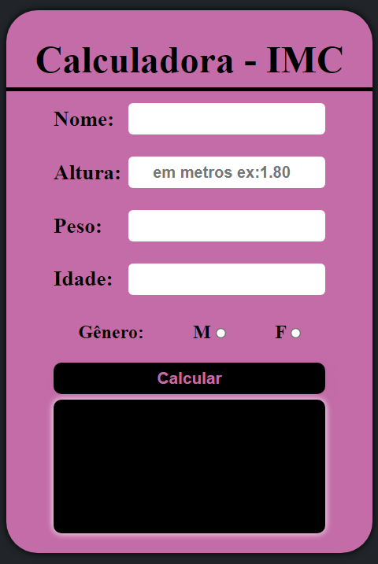

<h1 align="center">Calculadora de IMC</h1>

  

## 💣 Projeto

A calculadora de IMC tem como objetivo calcular o indice de massa corporal com base em calculos de altura e massa do individuo, adicionando também o consumo recomendado de calorias diarias.

## 💻 Tecnologias

Esse projeto foi desenvolvido com as seguintes tecnologias:

- [CSS3]
- [JavaScript]

Desenvolvido por iSz.
